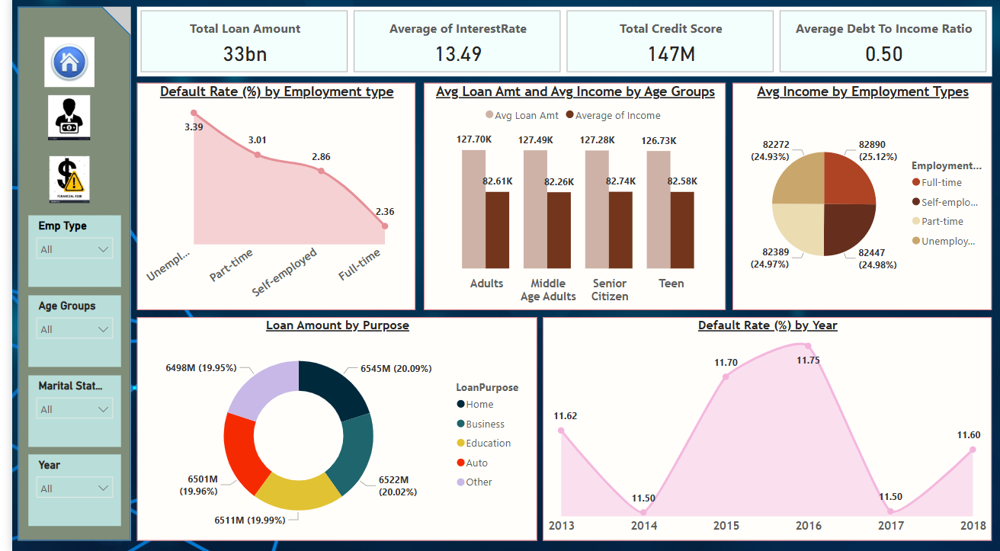
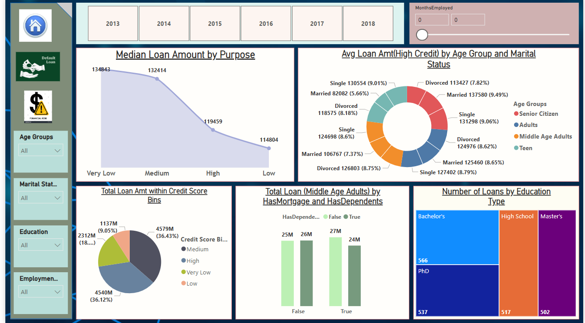
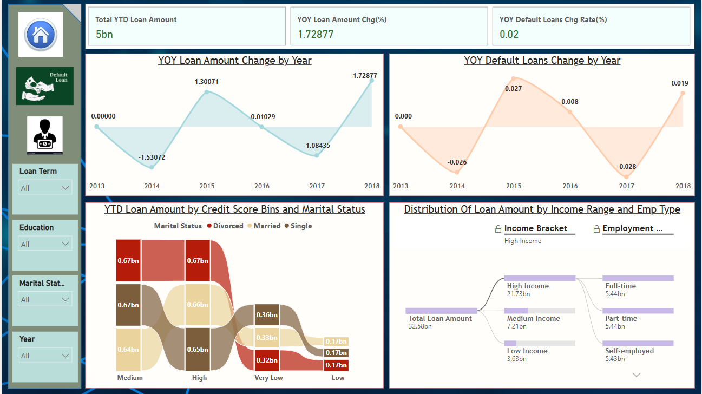

# 💡 Loan Default Risk Analysis Dashboard

This Power BI project provides an interactive visual analysis of factors influencing **loan defaults**, credit trends, and customer behavior. The dashboard allows stakeholders to make informed decisions by exploring key variables like employment status, credit score, loan purpose, age group, income range, and more.

---

## 📊 Dashboard Overview

### ✅ Page 1 – Loan Overview & Default Insights
- **KPIs**: Total Loan Amount (33bn), Avg Interest Rate (13.49%), Total Credit Score (147M), Avg Debt-to-Income Ratio (0.50).
- **Visuals**:
  - Default Rate by Employment Type.
  - Avg Loan Amount & Avg Income by Age Group.
  - Income Distribution by Employment Type.
  - Loan Amount Distribution by Purpose.
  - Default Rate Trend (2013–2018).

### 📈 Page 2 – Credit & Income Segmentation
- **Visuals**:
  - Median Loan Amount by Credit Score Bins.
  - High Credit Loan Amount by Age Group and Marital Status.
  - Loan Distribution by Credit Score Bins.
  - Total Loan among Middle-Aged with/without Mortgage & Dependents.
  - Number of Loans by Education Type.

### 📉 Page 3 – Year-on-Year Trend Analysis
- **KPIs**: YTD Loan Amount, YOY Loan Amount Change (%), YOY Default Loan Change Rate (%).
- **Visuals**:
  - YOY Loan Amount Trend.
  - YOY Default Loan Trend.
  - Loan Distribution by Credit Score and Marital Status.
  - Distribution of Loan Amount by Income Range & Employment Type.

---

## 🔄 Dataflow Process: Flat File → MySQL → Power BI

This dashboard was built using the following end-to-end ETL and data modeling pipeline:

### 📥 Step 1: Data Import into MySQL
- Source: **Flat file (CSV/Excel)** containing raw loan application data.
- Tool: **MySQL Workbench** or command-line MySQL.
- Action: Imported flat file into MySQL using the `LOAD DATA INFILE` or import wizard.

### 🧹 Step 2: Data Cleaning & Structuring in MySQL
- Performed data validation (e.g., NULL checks, duplicates).
- Normalized tables using customer ID and application ID as keys.
- Indexed key columns for performance optimization.

### 🔗 Step 3: Connecting Power BI to MySQL
- Opened **Power BI Desktop**.
- Used **MySQL database connector** (via “Get Data”) to connect to the hosted MySQL instance.
- Selected and imported a cleaned table.

### 🔄 Step 4: Data Transformation in Power BI
- Transformed data using **Power Query Editor**:
  - Removed nulls, renamed columns, changed data types.
  - Created calculated columns (e.g., Credit Score Bins, Income Groups).

### 📊 Step 5: Visualization & KPIs
- Built custom DAX measures to calculate:
  - Total Loan Amount
  - Default Rate
  - YOY Loan Change
- Designed visual pages with slicers and interactive charts.

### 🔁 Step 6: Refresh & Automation (Optional)
- Set up a **scheduled refresh** in Power BI Service using a MySQL gateway.

---

## 📁 Files in Repository

| File | Description |
|------|-------------|
| `Loan_Default_Analysis.pbix` | Power BI dashboard file |
| `Loan_default.csv `| Raw Dataset |
| `README.md` | Project documentation |
| `.gitignore` | Git tracking exclusions |
| `images/` | Screenshots of dashboard pages |

---

## 🧠 Key Insights


- **Unemployment** correlates with the **highest default rate (3.39%)**.
- **Home loans** and **auto loans** account for the majority of issued loans.
- **Full-time employees** have the **lowest default rate** and **highest income** on average.
- **Loan defaults peaked** in **2016**, followed by a significant decline.
- **Credit scores** and **marital status** influence both **loan amount** and **default risk**.
- Loan amounts increased steadily from 2013 to 2018, with minor drops in 2014 and 2017.
- Default rates peaked in 2015 and slightly increased in 2018 after a dip.
- High-income individuals and full-time employees dominate loan issuance.
- **Married applicants** with high credit scores received the largest loans.
- Education and employment types show evenly distributed loan counts.


---

## 📌 Dependencies

- Microsoft Power BI Desktop (latest version recommended)

---

## 🚀 Getting Started

1. Clone the repository  
   ```bash
   git clone https://github.com/Harddik1611 Financial-Analysis-of-a-Loan-Dataset.git
   ```

2. Open the `.pbix` file in Power BI Desktop.

3. Interact with slicers and visuals to explore the insights.

---

## 📃 License

This project is open-source and available under the [MIT License](LICENSE).

---

## 📷 Dashboard Previews

### 🔹 Loan Default & Overview


### 🔹 Applicant Financial Profile


### 🔹 Financial Risk Metrics



---

## 🙌 Author

**Harddik**  
[GitHub](https://github.com/Harddik1611)
